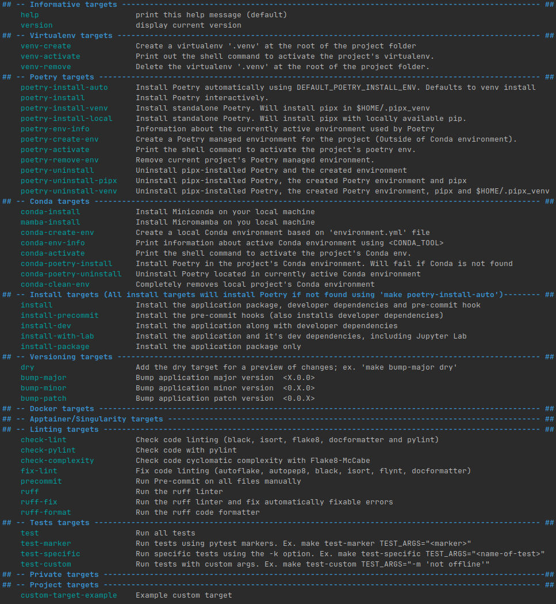

# Makefile documentation

This folder contains the base makefile targets.

The project uses a Makefile to automate most operations. If `make` is available on your
machine there's a good chance this will work.

## The Makefiles

The following Makefile files should not be modified, but can be consulted:

- [Makefile](../Makefile) : Entrypoint of the makefile utilities.
- [base.make](base.make) : Shared utilities, project agnostic.
- [conda.make](conda.make) : Conda related targets.
- [lint.make](lint.make) : Linting and formatting related targets.
- [poetry.make](poetry.make) : Poetry related targets.
- [manager.make](manager.make) : Manages which group to include based on Makefile variables.
- [test.make](test.make) : Test related targets.
- [uv.make](uv.make) : UV related targets.

The following Makefile files are project or user specific and can be modified by
project users:

- [Makefile.variables](../Makefile.variables) : Shared project variables.
    - In this file, you can activate or deactivate target groups, and configure
        settings according to your project's needs.
- [Makefile.targets](../Makefile.targets) : Shared project targets.
- [Makefile.private](../Makefile.private.example) : User specific variables and targets.
    - This file is ignored by git and should never be committed, as it can also contain
        secrets. You can override project configurations for local requirements, as
        well as personal preferences.
    - You can create your own version locally by copying from
        [Makefile.private.example](../Makefile.private.example)

## Basic Information

The different targets and their description can be examined by executing the command:

If there is a problem with the contents of these targets, please open an
issue [here](https://github.com/RolnickLab/lab-advanced-template/issues).

If you know how to fix the problem, please also consider opening a pull request with
your proposed solution.

You can always override the faulty targets located here by creating new targets
with the same names inside [Makefile.targets](../Makefile.targets).

The Makefile and `bump-my-version` related files in this directory are to help with
change tracking for the makefile itself. If you are using this makefile as part of a
template in another repository, you won't have to interact with them.

## Tests

Makefile tests can be found in the [.make/tests/](tests) folder. Current tests are
essentially bash scripts to test the different makefile targets.

These should only be run when modifying the makefiles inside the
[Template's repository](https://github.com/RolnickLab/lab-advanced-template).

They should **never** be run in a project implemented from the template, as they could
cause side effects to your project.
