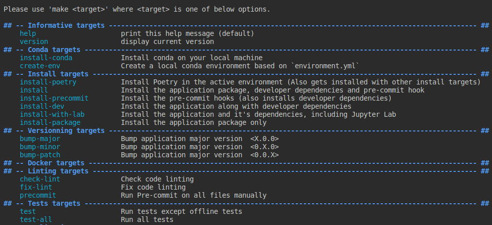

# Geospatial Tools

## Requirements

This project has only been tested in a Linux (Debian based) environment and assumes
some basic tools for development are already installed.

The project uses a Makefile to automate most operations. If you can run make on your 
machine there's a good chance this will work on your machine.

Please consult the [Makefile](Makefile) before trying to use it.

## Basic Information

Much of this repository is organized through the Makefile.

The different targets and their description can be examined by executing the command
`make targets`



## Installation

This project assumes environment management will be done with Conda. It would, however,
be possible to create you own environment with, for example, poetry, pyenv or virtualenv.

**Do note that this project is configured to use [Poetry](https://python-poetry.org/)
and as such, this tool is required to install it.**

Poetry is not included in the [environment.yml](environment.yml), due to some problems
in compute cluster environments, but will be installed automatically if needed
by most `install` targets.

If you need or want to install Conda:
```
make install-conda 
```

To create the conda environment:
```
make create-env
```

After you have created your Conda environment, or you want to manage your environment 
yourself, make sure to activate it properly before installing this package.

To install the package, development dependencies and CLI tools (if available):
```
make install
```

To install only the package, without development tools:
```
make install-package
```

## Basic automations

To run linting checks with `flake8`, `pylint`, `black` and `isort`:
```
make check-lint
```

To fix linting with `black`, `flynt` and `isort`:
```
make fix-lint
```

To run a `pre-commit` check before actually committing:
```
make precommit
```

To run tests:
```
make test
```

To run all tests, including the integration test:
```
make test-all
```

## Data

## Contributing to this repository

See [Contributing guidelines](CONTRIBUTING.md)

## Configurations
Configurations are in the [config/](config) folder.

