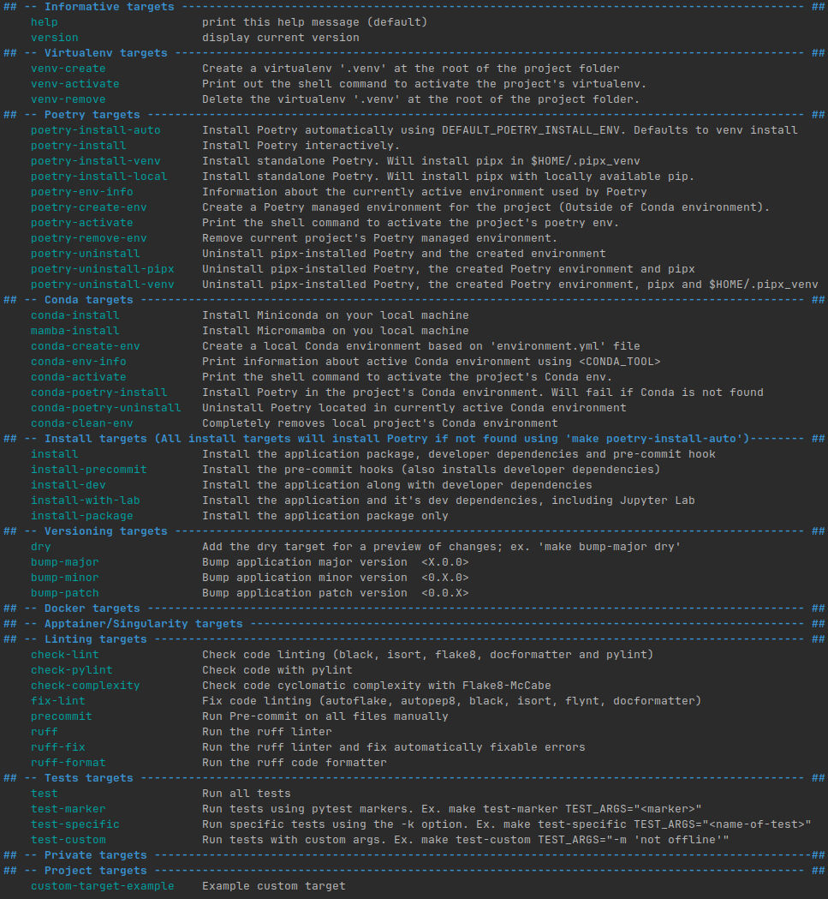

# ClimatesetExtension

## Tools and Makefile structure

The project uses a Makefile to automate most operations. If make is available on your 
machine there's a good chance this will work.

The following Makefile files should not be modified, but can be consulted:

* [Makefile](Makefile) : Orchestration of the different files
* [base.make](.make/base.make) : Shared utilities, project agnostic.

The following Makefile files are project or user specific:

* [Makefile.variables](Makefile.variables) : Shared project variables.
* [Makefile.targets](Makefile.targets) : Shared project targets.
* [Makefile.private](Makefile.private.example) : User specific variables and targets.

### Basic Information

The different targets and their description can be examined by executing the command
`make targets`

Ex.



## Requirements

This project has only been tested in a Linux (Debian based) environment and assumes
some basic tools for development are already installed.

It also requires that minimally `Python`, `pip` and `venv` are available on your system.

This project assumes environment management will be done with `Conda` or directly through
`Poetry`. 

* [Poetry](https://python-poetry.org/docs/basic-usage/)
* [Conda](https://conda.io/projects/conda/en/latest/user-guide/getting-started.html)

While it is possible to manage the environment with, for example, pyenv or virtualenv, 
those specific use cases are not supported by the Makefile and require users to set up 
their own environments beforehand.

For detailed information about `Poetry` and `Conda`:

If you want to use something else than `Conda` or `Poetry` to manage environment isolation, 
it is recommended to follow 
[Poetry's guidelines on managing environments](https://python-poetry.org/docs/managing-environments/)

Poetry is not included in the [environment.yml](environment.yml), due to some possible problems
in compute cluster environments, but will be installed automatically if needed
by most `install` targets.

Currently, the project runs on Python version 3.10.

## Environment management choices

Environment management can become quite complicated. Using Conda allows a certain
ease of management since the Poetry installation is contained inside the created Conda 
environment.

However, some computing environments do not permit the use of Conda (like certain SLURM
clusters). This is why the `pipx` option for Poetry is also enabled in this project.

**Unless you really know what you are doing, it is not recommended to install Poetry
as a standalone tool (with pipx) while also using Conda environments.**

There are 2 recommended ways to manage `Poetry` if it is not already configured on 
your system. Using `Conda`, or installing `Poetry` as a standalone tool using `pipx`

It is not recommended to install `Poetry` in the same environment that will be managed
by `Poetry` in order to minimize dependency conflicts.

### Note about Pipx installation 

If you want to install `Poetry` using `pipx`, and pipx is not already 
installed on your system, it will be installed using `pip`. 

Write access to that environment is required (use `which pip` to learn which 
environment is active if not sure).

Particularly on remote compute clusters (SLURM), default system `pip` will probably not 
allow users to install packages. One way around it is to create a generic virtual 
environment using `venv` like so (preferably in your $HOME). It can be done manually using the 
following commands:

Ex.
```
python -m venv $HOME/.venv
source $HOME/.venv/bin/activate
pip install pipx
pipx ensurepath
pipx install poetry
deactivate
```

This virtual environment can be deactivated afterward, as Poetry will still be 
available to the user.

There are also targets in the [Poetry section](#using-poetry) that handle this use case.

## Using Conda

If you need or want to install Conda:
```
make conda-install 
```

To create the conda environment:
```
make conda-create-env
```

To remove the conda environment:
```
make conda-clean-env
```

To install `Poetry` using `Conda` (after conda environment as been created:

```
make conda-poetry-install
```

To remove poetry from the Conda environment:

```
make conda-poetry-uninstall
```

Make sure to activate the conda environment before moving on the 
[install targets](#install-targets).

## Using Poetry

The following target will first try to install `Poetry` in the active `Conda` 
environment; if it can't find `Conda`, it will proceed to install via `pipx`

```
make poetry-install-auto
```

The following target will allow environment management directly with a standalone 
`Poetry` installation through `pipx`. It will also create a virtual environment managed 
by `Poetry` that uses Python 3.10.

```
make poetry-install
```

If the compute environment requires `pipx` to be installed in a virtual environment:

```
make poetry-install-venv
```

If you already have Poetry installed and configured, or want to recreate it later, 
an environment for the project can also be created using:

```
make poetry-create-env
```

and removed using: 

```
make poetry-remove-env
```

Information about the currently active environment used by `Poetry`, 
whether `Conda` or `Poetry`, can be seen using:

```
make poetry-env-info
```

To remove `Poetry` that was installed with `pipx` (be sure to execute this command in 
the environment where pipx is installed):

```
make poetry-uninstall
```

To uninstall both `Poetry` and `pipx` (again, be sure to execute this command in 
the environment where pipx is installed):

```
make poetry-uninstall
```

If `Poetry` and `pipx` were installed using the `make poetry-install-venv`, they can be 
removed, including the virtual environment, using:

```
make poetry-uninstall-venv
```

**Important note!**

If you have an active `Conda` environment  and install `Poetry` using `pipx`,
you will have to use `poetry run python <your_command_or_script_path>` instead of 
`python <your_command_or_script_path>`, (which is normal when using Poetry) as 
Conda's active environment will define the available default `python` executable.


## Installing the python package and it's dependencies

**All `install` targets will first check if `Poetry` is available and try to install
it with the `make poetry-install-auto` target.**

To install the package, development dependencies and CLI tools (if available):
```
make install
```

To install only the package, without development tools:
```
make install-package
```

## First time user quick setup

### Conda
The easiest and quickest way to get up and running with Conda.

Create Conda environment (will check for Conda and install it if not found):

```
make conda-create-env
```

Activate Conda environment (substitute with your <CONDA_TOOL> if something else 
than `conda`:

```
conda activate climateset
```

Install package:

```
make install
```

### Poetry

The easiest and quickest way to get up and running with Poetry.

Install pipx and Poetry and activate project environment :

```
make poetry-install 
```
_can be replaced by `make poetry-install-venv` if needed_

If Poetry is already available, the environment can be created using:

```
make poetry-create-env
```

Install package:

```
make install
```

## Basic automations

To run linting checks with `flake8`, `pylint`, `black` and `isort`:
```
make check-lint
```

To fix linting with `black`, `flynt` and `isort`:
```
make fix-lint
```

To run a `pre-commit` check before actually committing:
```
make precommit
```

To run tests:
```
make test
```


## Data

## Experiment tracking

Nothing is set up for now, but since Weights and Bias is accessible to MILA and DRAC, it
will probably be the way to go.


## Training

## Contributing to this repository

See [Contributing guidelines](CONTRIBUTING.md)


### Configurations
Configurations are in the [config/](config) folder.


### Tests
