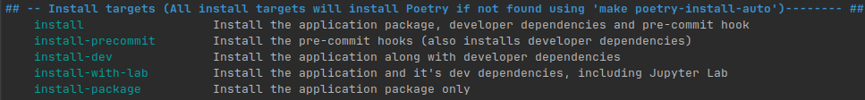

# Geospatial-Tools

## Description

This repository is a collection of tools and scripts for geospatial use cases.

## Requirements

This project has only been tested in a Linux (Debian based) environment and assumes
some basic tools for development are already installed.

The project uses a Makefile to automate most operations. If `make` is available on your
machine there's a good chance this will work.

The following Makefile files should not be modified, but can be consulted:

- [Makefile](Makefile) : Orchestration of the different files
- [base.make](.make/base.make) : Shared utilities, project agnostic.

The following Makefile files are project or user specific:

- [Makefile.variables](Makefile.variables) : Shared project variables.
- [Makefile.targets](Makefile.targets) : Shared project targets.
- [Makefile.private](Makefile.private.example) : User specific variables and targets.
  - This file is ignored by git and should never be committed, as it can also contain
    secrets.
  - You can create your own version locally by copying from
    [Makefile.private.example](Makefile.private.example)

## Basic Information

The different targets and their description can be examined by executing the command
`make targets`


## Python Version

This project uses Python version 3.11

## Build Tool

This project uses `poetry` as a build tool. Using a build tool has the advantage of
streamlining script use as well as fix path issues related to imports.

## First Time User Quick Setup

### Installing poetry

If on a compute cluster, first load the appropriate python module:

- [How to create a virtual environment for the Mila cluster](docs/environment_creation_mila.md)
- [How to create an environment for the DRAC cluster](docs/environment_creation_drac.md)

Installing `pipx` and `poetry`:

```shell
make poetry-install
```

Next, let's choose how to manage our development environment

### Environment management choice

Choose between managing your development with either `virtualenv`, `poetry` or `conda`.

#### Virtualenv (or Venv)

This is the simplest way and what most people in the lab are already used to.

Make sure that `python 3.10 or 3.11` is available either locally, through loaded cluster
modules (ex. `module load python/<PYTHON_VERSION>`) or `pyenv` before executing the
following command:

```shell
make venv-create
```

You can see the shell command to activate the environment with the following target:

```shell
make venv-activate
```

#### Poetry

Make sure that `python 3.10 or 3.11` is available either locally, through loaded cluster
modules (ex. `module load python/<PYTHON_VERSION>`) or `pyenv` before executing the
following command:

```shell
make poetry-create-env
```

Make sure to read up
on [how to use your poetry virtual environment](https://python-poetry.org/docs/basic-usage/#using-your-virtual-environment)

You can:

- Use the `poetry run` command to access your executables
  - ex. `poetry run python your_script.py`, or `poetry run pylint src/`
- Use the `poetry shell` command to activate and step in your project environment

#### Conda

Reminder: `conda` is not available on DRAC.

If working on the Mila cluster, first load the appropriate module :
`module load anaconda/3`

1. Create `conda` environment (will check for `conda` and install it if not found):

```shell
make conda-create-env
```

2. Activate `conda` environment (substitute with your \<CONDA_TOOL> if something else
   than `conda`:

```
conda activate <environment_name>
```

### Install

Once the environment is taken care of, you can verify everything with the following
command before continuing:

```shell
make poetry-env-info
```

or

```shell
poetry env info
```

To install the package and its dependencies:

```shell
make install
```

This also installs and configures the `pre-commit` hook. See ...

### Development

1. [Add required dependencies](./CONTRIBUTING.md#adding-dependencies)
2. Create some new modules in the [src](./src) folder!

## Detailed documentation

This project assumes environment management will be done with `conda`, a classic
python virtual environment, or directly through `poetry`.

- [Poetry](https://python-poetry.org/docs/basic-usage/)
- [Conda](https://conda.io/projects/conda/en/latest/user-guide/getting-started.html)

While it is possible to manage the environment with, for example, pyenv or virtualenv,
those specific use cases are not supported by the Makefile and require users to set up
their own environments beforehand.

If you want to use something else than `conda` or `poetry` to manage environment isolation,
it is recommended to follow
[Poetry's guidelines on managing environments](https://python-poetry.org/docs/managing-environments/)

`poetry` is not included in the [environment.yml](environment.yml), due to some possible problems
in compute cluster environments, but will be installed automatically if needed
by most `install` targets.

See [Environment and Install targets](docs/makefile_environment_targets.md) for more
information.

### Environment Management

Your project will need a virtual environment for your dependencies.

- [How to create a virtual environment for the Mila cluster](docs/environment_creation_mila.md)
- [How to create an environment for the DRAC cluster](docs/environment_creation_drac.md)
- [How to create a Conda environment](docs/conda_environment_creation.md)
- [Migrating to DRAC from another environment](docs/migrating_to_drac.md)

There are different ways of managing your python version in these environments. On the
clusters, you have access to different python modules, and through `conda` you have access
to practically all the versions that are available.

However, on your own system, if you do not wish to use `conda`, you will have to either
manually install different versions of python manually for them to be usable by `poetry`
or use a tool like [pyenv](https://github.com/pyenv/pyenv).

Do note that `conda` is not available on the DRAC cluster, and there are some extra steps
to use `conda` on the Mila cluster compared to a workstation.

#### How to use conda with poetry

When using `conda`, it is important to understand that it is both an environment management
tool AND a dependency management tool... and so is `poetry`. The difference is that with `conda`
you can install different versions of python, as well as have access to non
python applications and binary packages.

To use them together, it is recommended to use `conda` as the environment and python
version manager, for non-python dependencies, and use `poetry` as the python
dependency manager.

Using both `conda` and `poetry` (and `pip` directly, for that matter), to install and
manage python dependencies is a great recipe for breaking your environment.

If you do need to install python dependencies in both (ex. pytorch through `conda`, and
others using `poetry`), you need to be cautious as one dependency manager can and will
interfere with the dependencies managed by the other one and will make dependency
conflicts challenging to fix.

If there are no ways around it, you could also manage and use two environments at the same time
(one via conda and one via poetry). This, however, requires an enormous amount of discipline
to work and is strongly discouraged.

#### Environment management choices

The choice of which environment manager to use between `conda` and `poetry` is ultimately
determined by either project requirements or personal preference. Both are allowed and
supported by this project.

### Installation

There are a few installation targets available.



Generally, `make install` is the most useful, but the others can have their uses.
For example, using `make install-package` is great for an environment where
you will only be executing your code and do no development.

### Useful Makefile targets for development

To run linting checks with `flake8`, `pylint`, `black`, `isort` and `docformatter`:

```shell
make check-lint
```

To fix linting with `autoflake`,`autopep8`,`black`, `isort`, `flynt` and `docformatter`:

```shell
make fix-lint
```

To run a `pre-commit` check before actually committing:

```shell
make precommit
```

To run tests:

```shell
make test
```

#### The use of Nox

Behind the scenes, the targets in this section make use of the
[Nox automation tool](https://nox.thea.codes/en/stable/).

The configurations can be found in the [noxfile.py](noxfile.py) file.

For more information about how `nox` is used in this project, see
[Nox session descriptions](docs/nox_session_descriptions.md).

#### Experimental targets

The `ruff` tool is now also available in the makefile. This tool is not yet integrated
into the `pre-commit` configuration and should be used, optionally, as a complement to
the other code quality tools.

To run linting using `ruff`:

```shell
make ruff
```

To run linting using `ruff` and fix automatically fixable warnings:

```shell
make ruff-fix
```

To run code formatting using `ruff`

```shell
make ruff-format
```

For more information of `ruff`, see it's [official documentation here](https://docs.astral.sh/ruff/).

## Configurations

Configurations are in the [config/](configs) folder.

## Data

See [Data Readme](data/README.md)

## Contributing to this repository

See [Contributing guidelines](CONTRIBUTING.md)
